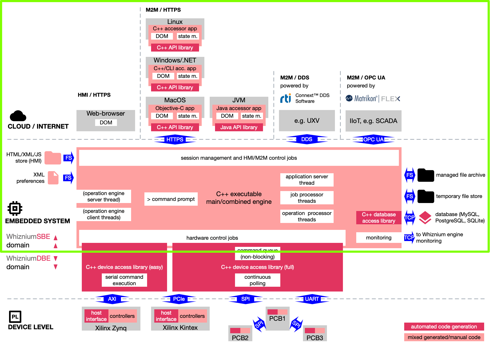

# WhizniumSBE

The Whiznium Service Builder's Edition, finally as Open Source Software project.

WhizniumSBE is a tool for the model-based development of modern, multi-threaded, connected C++ application software, with focus on single board computers.

## How it works

Besides being model-based, software development with WhizniumSBE rests on the foundation of these three principles:
-	Full coverage: one single method of model entry is used for all application aspects, ranging from database access to thread-safe inter-object communication to preferences file and web-based user interface with detailed access rights management
-	All code in plain sight: no functionality is hidden away in libraries
-	Mixing of auto-generated code with manual additions: auto-generated code provides the backbone of the (single) project source code tree; it is meant to be extended manually, with manual changes carried over to the next version when the model changes

## Dependencies

WhizniumSBE-generated code is free from any use restrictions, except for the obvious fact that no exclusivity for the resulting coding style and / or web UI look & feel can be claimed by any user.

### WhizniumSBE-backed projects

Only few libraries are required, all of which are equipped with permissive licenses, allowing to deploy WhizniumSBE-backed software both as Open Source Software and commercially:

- [Gnome libxml2](http://xmlsoft.org), to serlialize / deserialize XML blocks both for HTTP(S) transfers and preferences files
- [GNU Libmicrohttpd](https://www.gnu.org/software/libmicrohttpd), a lightweight multi-threading-capable web-server library included in every WhizniumSBE-backed project
- [libcurl](https://curl.haxx.se/libcurl), to handle inter-executable master / slave XML-over-HTTP(S) communication. Required only for large WhizniumSBE-backed projects, such as WhizniumSBE/DBE themselves, where functionality is distributed across a central engine executable and multiple operation engine executables

Furthermore, at least one DBMS client library is needed; options include:

- [SQLite 3](https://www.sqlite.org/index.html), the only server-less solution supported, best suited for embedded software projects
- [MariaDB](https://mariadb.org), the open source branch of MySQL
- [MySQL](https://www.mysql.com), the most widely-spread DBMS provided by Oracle
- [PostgreSQL](https://www.postgresql.org)

In some applications so far, WhizniumSBE-backed projects needed either OPC UA or DDS connectivity. While code generated to use the corresponding library API's is license-free, the corresponding SDK's are commercial software:

- [Matrikon FLEX OPC UA SDK](https://www.matrikonopc.com/campaigns/opc-ua/matrikon-opc-ua-sdk.aspx)
- [rti Connext DDS](https://www.rti.com/products)

### WhizniumSBE itself

WhizniumSBE is a WhizniumSBE-backed project. Accordingly, it requires libxml2, GNU Libmicrohttpd and libcurl to work. Our preferred choice for DBMS is MariaDB.

## Resources for now

### Use cases

- Whiznium StarterKit: a tabletop 3D laser scanner reference implementation on various platforms: Zynq (ARM and Xilinx FPGA) and i.MX6 (ARM) for now, PolarFire SoC (RISC-V and Microchip FPGA) and standalone (workstation and MCU-based peripherals) in the making. [Git repository](https://github.com/mpsitech/wzsk-Whiznium-StarterKit)
- FabSight: montioring of industrial appliances, [.pdf datasheet](https://mpsitech-public.s3.eu-central-1.amazonaws.com/fabsight.pdf) and [YouTube video](https://youtu.be/Z-NvdSHfAvM) showing device in action including .NET API access
- The ICARUS detector: a [European robotics research project](http://www.fp7-icarus.eu) alongside which WhizniumSBE/DBE developed lots of its functionality, [.pdf datasheet](https://mpsitech-public.s3.eu-central-1.amazonaws.com/icarus.pdf)
- Multi-spectral detector: developed from the ICARUS detector, combines stereo vision with a thermal imager and a laser mounted on a tilt/pan unit. [.pdf code walk-through](https://mpsitech-public.s3.eu-central-1.amazonaws.com/Thermal_Imager_Data_Path.pdf) available
- BeamRelay: a cool air traffic simulation developed when Whiznium's focus was still on distributed simulation applications, [.pdf datasheet](https://mpsitech-public.s3.eu-central-1.amazonaws.com/beamrelay.pdf) available and [ICNS conference proceedings .pdf](https://mpsitech-public.s3.eu-central-1.amazonaws.com/Global_coverage_free_space.pdf)

### Reference / documentation

- Documentation of model files (slightly outdated) as [Git repository](https://github.com/mpsitech/WhizniumSBE-docs)
- [YouTube video](https://youtu.be/yBvqSAvEhDg) of the most essential workflow step when using WhizniumSBE - iterating a source code tree
- A [.pdf datasheet](https://mpsitech-public.s3.eu-central-1.amazonaws.com/M2M_communication_v2.pdf) highlighting M2M communication options in WhizniumSBE-backed projects

### Marketing material

Most of these publications pre-date Whiznium's Open Source era.

- WhizniumSBE/DBE [.pdf flyer](https://mpsitech-public.s3.eu-central-1.amazonaws.com/flyer_en_v1.1.pdf)
- WhizniumSBE technology overview [.pdf datasheet](https://mpsitech-public.s3.eu-central-1.amazonaws.com/whizniumsbe.pdf)
- Whiznium-related services offerings for the photonics industry [.pdf flyer](https://mpsitech-public.s3.eu-central-1.amazonaws.com/epic_flyer.pdf)
- Co-marketing of Whiznium and Matrikon's FLEX OPC UA SDK for industrial automation applications [.pdf flyer](https://mpsitech-public.s3.eu-central-1.amazonaws.com/FLEX_MPSI_DataSheet-V2.1.pdf)

## Upcoming documentation

- The Whiznium book (draft available [here](https://mpsitech-public.s3.eu-central-1.amazonaws.com/book.pdf)), offering an introduction to WhizniumSBE/DBE by means of a handy use case in the first chapters, but also with a complete reference in the later chapters

## Related Repositories

- The [WhizniumSBE core library](https://github.com/mpsitech/sbecore-WhizniumSBE-Core-Library)
- [WhizniumDBE](https://github.com/mpsitech/wdbe-WhizniumDBE), Whiznium Device Builder's Edition, counterpart for developing RTL projects with VHDL as main programming language

## Contact

The Whiznium project is developed and curated by Munich-based start-up [MPSI Technologies GmbH](https://www.mpsitech.com). Feel free to [contact us](mailto:contact@mpsitech.com) with any questions.
