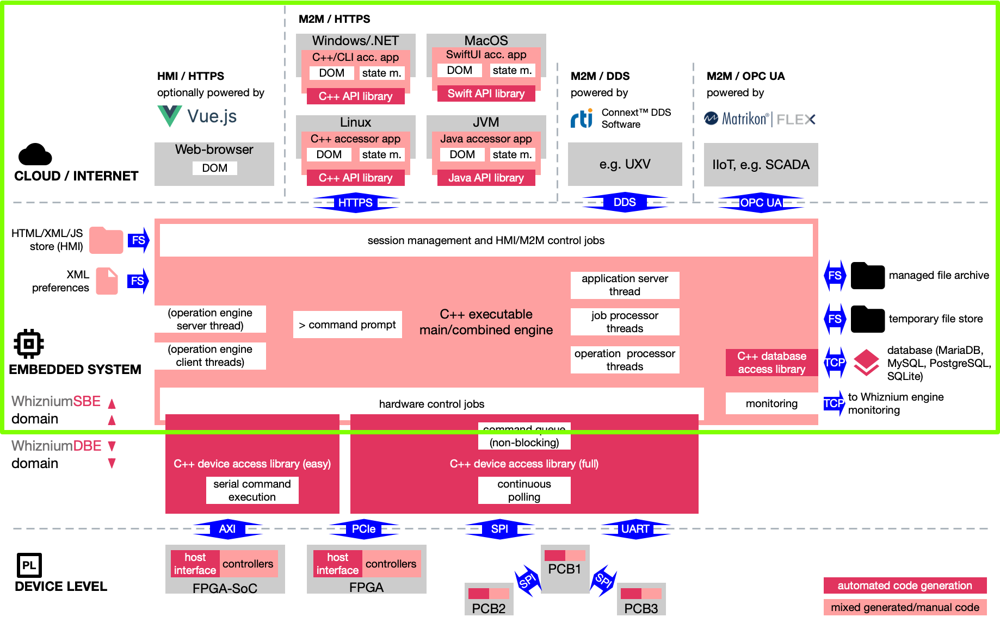

# WhizniumSBE

The Whiznium Service Builder's Edition, finally as Open Source Software project.

WhizniumSBE is a tool for the model-based development of modern, multi-threaded, connected C++ application software, with focus on single board computers.

## How it works

Besides being model-based, software development with WhizniumSBE rests on the foundation of these three principles:
-	Full coverage: one single method of model entry is used for all application aspects, ranging from database access to thread-safe inter-object communication to preferences file and web-based user interface with detailed access rights management
-	All code in plain sight: no functionality is hidden away in libraries
-	Mixing of auto-generated code with manual additions: auto-generated code provides the backbone of the (single) project source code tree; it is meant to be extended manually, with manual code carried over to the next version when the model changes

## Setup instructions, reference and cheat sheet

To prepare your system for use with Whiznium and to learn how to make your first steps, please visit this [separate Git repository](https://github.com/mpsitech/The-Whiznium-Documentation).

The primary source for all WhizniumSBE-related information is the [WhizniumSBE reference](https://mpsitech.github.io/The-WhizniumSBE-Reference).

To streamline the everyday WhizniumSBE-enhanced development workflow, the [WhizniumSBE .pdf cheat sheet](https://content.mpsitech.cloud/cheatsheet_wznm.pdf), packed with useful information, might come in handy. A paper copy (size A2) can be ordered free of charge [here](https://content.mpsitech.cloud/cheatsheet.html).

## The Whiznium Developer Experience YouTube format

WhizniumSBE-related episodes so far include:

- [S1E1](https://youtu.be/SIz8meoCUl4): Why Whiznium? Let a laser scanner do the talking. 
- [S1E2](https://youtu.be/_J5aEs5J9tE): Whiznium modeling: Any aspect that's fit to code.
- [S1E3](https://youtu.be/Zf6G5EiLEak): Hunting down bugs in Whiznium application code.
- [S1E4](https://youtu.be/NqhiURBacEI): Boosting your development workflow: the Whiznium tooling.

## Source code

### Directory structure

Sub-folder|Content|
-|-|
_ini|database/tool initialization files|
_mdl|model files, text-based and diff-able between versions|
_rls|Makefiles and build/deploy scripts|
apiwznm|auto-generated C++ API library (not in use for now)|
dbswznm|auto-generated C++ database access library|
japiwznm|auto-generated Java API library (used for WhizniumSBE Bootstrap and WhizniumSBE Iterator)|
webappwznm|mixed auto-generated/manual HTML5/JS web-based user interface|
wznmcmbd|mixed auto-generated/manual C++ sources for all WhizniumSBE functionality|
wznmd|auto-generated C++ code specific for WhizniumSBE engine|
wznmopd1|auto-generated C++ code specific for WhizniumSBE operation engine 1 / non-template functionality|
wznmopd2|auto-generated C++ code specific for WhizniumSBE operation engine 2 / user-specific template functionality|

### Code highlights

Below is a non-exhaustive list of C++ source code files where interesting things happen:

File|Functionality|
-|-|
wznmcmbd/CrdWznmVer/DlgWznmVerNew.cpp|UI element (dialog) where a new project version can be created|
wznmcmbd/CrdWznmRls/DlgWznmRlsWrite.cpp|dialog which (re-)composes a project's source code tree, handles the required repository transactions, and which delegates code writing - fragmented into thousands of atomic operations - to the operation engines|
wznmcmbd/IexWznm/JobWznmIexDbs.cpp|mixed auto-generared/manual parsing (and data collecting/writing) of database structure model files; relevant method enterSgeParse()|
wznmcmbd/IexWznm/IexWznmDbs.cpp|auto-generated combined XML/text reader/writer for database structure model files|
wznmcmbd/WznmPrctree/WznmPrctree.cpp|parsing of source code files and tokenizing for identification of insertion points, the feature allowing Whiznium to extract manually written code from source code trees|
wznmcmbd/WznmGen/WznmGenDetui.cpp|generate detailed user interface (panels, queries, dialogs and controls) based mainly on basic UI and database structure information|
wznmcmbd/WznmGen/WznmGenJob.cpp|generate job tree (hierarchy of run-time C++ classes) based on previously imported and generated model information|
wznmcmbd/WznmWrdbs/WznmWrdbsTbl.cpp|write wrapper code for single database table, morphing records in C++ objects and record sets in C++ STL containers; includes convenient SQL-free load functions|
wznmcmbd/WznmWrsrv/WznmWrsrvJob.cpp|write basic structure of every job (run-time C++ class) including sensitivities and optional state machine|
wznmcmbd/WznmWrsrv/WznmWrsrvDlg.cpp|write code specific for dialog (UI element) jobs|
wznmcmbd/WznmWrweb/WznmWrweb.cpp|write HTML and JS code e.g. for controls|

## Template files

WhizniumSBE's automated source code generation relies on template files with inline placeholders and insertion points for multi-line code fragments. For each version of WhizniumSBE, the relevant template files can be found [online](https://content.mpsitech.cloud/WhizniumSBE/v1.0.2/files.tgz); they are part of the tool initialization routine.

### Some highlights

File|Functionality|
-|-|
CrdXxxxYyy.html|HTML code for a card, representing the top-level file for a browser tab|
CrdXxxxYyy.js|JavaScript code for a card, handling - among other things - server XHD interaction|
DbsXxxx.h|database access library C++ header|
JobXxxxYyyZzzzz.cpp|C++ code for every job (run-time C++ class)|
Makefile_Cmbeng|Makefile for combined engine|
PnlXxxxYyyZzzzz.js|JavaScript code for a tabular data view panel|
Xxxx.h|C++ header for common engine/operation functionality|
Xxxxcmbd_exe.cpp|combined engine executable C++ code including main()|
Xxxxcmbd.cpp|combined engine exchange object C++ code|
XxxxcmbdAppsrv.cpp|GNU Libmicrohttpd-based application server C++ code|
XxxxcmbdJobprc.cpp|job processor C++ code|

## Dependencies

WhizniumSBE-generated code is free from any use restrictions, except for the obvious fact that no exclusivity for the resulting coding style and / or web UI look & feel can be claimed by any user.

### WhizniumSBE-backed projects

Only few libraries are required, all of which are equipped with permissive licenses, allowing to deploy WhizniumSBE-backed software both as Open Source Software and commercially:

- [Gnome libxml2](http://xmlsoft.org), to serlialize / deserialize XML blocks both for HTTP(S) transfers and preferences files
- [GNU Libmicrohttpd](https://www.gnu.org/software/libmicrohttpd), a lightweight multi-threading-capable web-server library included in every WhizniumSBE-backed project
- [libcurl](https://curl.haxx.se/libcurl), to handle inter-executable master / slave XML-over-HTTP(S) communication. Required only for large WhizniumSBE-backed projects, such as WhizniumSBE/DBE themselves, where functionality is distributed across a central engine executable and multiple operation engine executables

Furthermore, at least one DBMS client library is needed; options include:

- [SQLite 3](https://www.sqlite.org/index.html), the only server-less solution supported, best suited for embedded software projects
- [MariaDB](https://mariadb.org), the open source branch of MySQL
- [MySQL](https://www.mysql.com), the most widely-spread DBMS provided by Oracle
- [PostgreSQL](https://www.postgresql.org)

In some applications so far, WhizniumSBE-backed projects needed either OPC UA or DDS connectivity. While code generated to use the corresponding library API's is license-free, the corresponding SDK's are commercial software:

- [Matrikon FLEX OPC UA SDK](https://www.matrikonopc.com/campaigns/opc-ua/matrikon-opc-ua-sdk.aspx)
- [rti Connext DDS](https://www.rti.com/products)

### WhizniumSBE itself

WhizniumSBE is a WhizniumSBE-backed project. Accordingly, it requires libxml2, GNU Libmicrohttpd and libcurl to work. Our preferred choice for DBMS is MariaDB.

## Further Reading

### Upcoming book

- The Whiznium book (draft available [here](https://content.mpsitech.cloud/book.pdf)), offering an introduction to WhizniumSBE/DBE by means of a handy use case

### Use cases

- Whiznium StarterKit: a tabletop 3D laser scanner reference implementation on various platforms. Zynq (ARM and Xilinx FPGA) and i.MX6 (ARM) available, PolarFire SoC (RISC-V and Microchip FPGA) and standalone (workstation and MCU-based peripherals) in the making. [Git repository](https://github.com/mpsitech/wzsk-Whiznium-StarterKit)
- FabSight: montioring of industrial appliances, [.pdf datasheet](https://content.mpsitech.cloud/fabsight.pdf) and [YouTube video](https://youtu.be/Z-NvdSHfAvM) showing device in action including .NET API access
- The ICARUS detector: a [European robotics research project](http://www.fp7-icarus.eu) alongside which WhizniumSBE/DBE developed lots of its functionality, [.pdf datasheet](https://content.mpsitech.cloud/icarus.pdf)
- Multi-spectral detector: developed from the ICARUS detector, combines stereo vision with a thermal imager and a laser mounted on a tilt/pan unit. [.pdf code walk-through](https://content.mpsitech.cloud/Thermal_Imager_Data_Path.pdf) available
- BeamRelay: a cool air traffic simulation developed when Whiznium's focus was still on distributed simulation applications, [.pdf datasheet](https://content.mpsitech.cloud/beamrelay.pdf) available and [ICNS conference proceedings .pdf](https://content.mpsitech.cloud/Global_coverage_free_space.pdf)

### Marketing material

Most of these publications pre-date Whiznium's Open Source era.

- WhizniumSBE/DBE [.pdf flyer](https://content.mpsitech.cloud/flyer_en_v1.1.pdf)
- WhizniumSBE technology overview [.pdf datasheet](https://content.mpsitech.cloud/whizniumsbe.pdf)
- A [.pdf datasheet](https://content.mpsitech.cloud/M2M_communication_v2.pdf) highlighting M2M communication options in WhizniumSBE-backed projects
- Whiznium-related services offerings for the photonics industry [.pdf flyer](https://content.mpsitech.cloud/epic_flyer.pdf)
- Co-marketing of Whiznium and Matrikon's FLEX OPC UA SDK for industrial automation applications [.pdf flyer](https://content.mpsitech.cloud/FLEX_MPSI_DataSheet-V2.1.pdf)
- Elektronik.net interview at Embedded World 2020 with the founder of MPSI Technologies [video, German only](https://www.elektroniknet.de/video/vip-buehne-startups-stellen-sich-vor-mpsi-technologies-2012-video.html)
- MPSI Technologies start-up pitch at Embedded World 2020 [video, from 20:15](https://www.embedded-world.de/de/events/vortrag/start-up-presentation-/767308)

## Related Repositories

- The [WhizniumSBE core library](https://github.com/mpsitech/sbecore-WhizniumSBE-Core-Library)
- [WhizniumDBE](https://github.com/mpsitech/wdbe-WhizniumDBE), Whiznium Device Builder's Edition, counterpart for developing RTL projects with VHDL as main programming language

## Contact

The Whiznium project is developed and curated by Munich-based start-up [MPSI Technologies GmbH](https://www.mpsitech.com). Feel free to [contact us](mailto:contact@mpsitech.com) with any questions.
